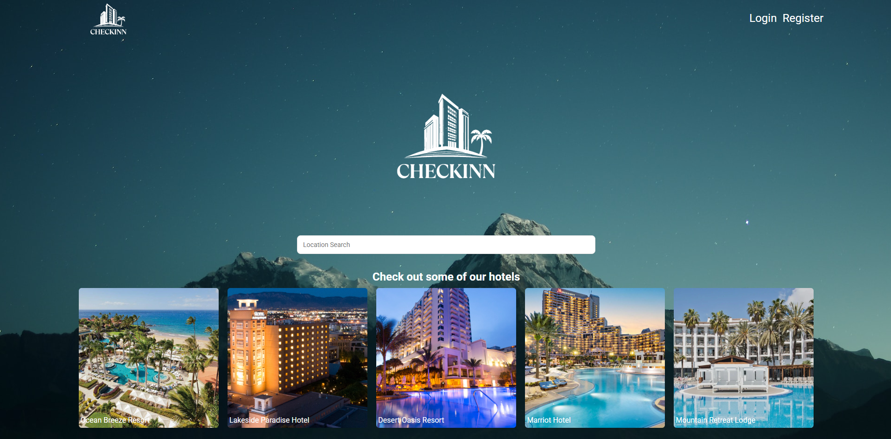
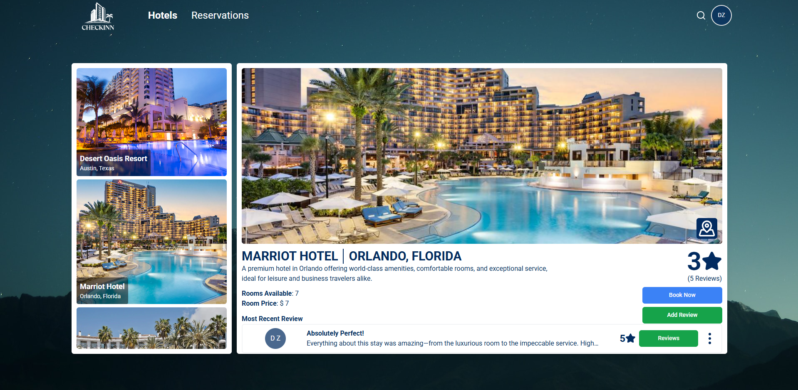
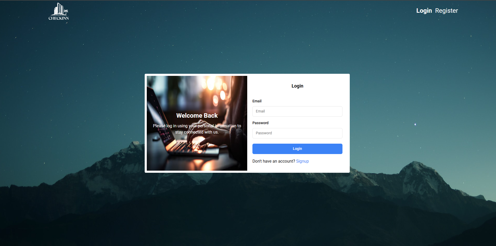
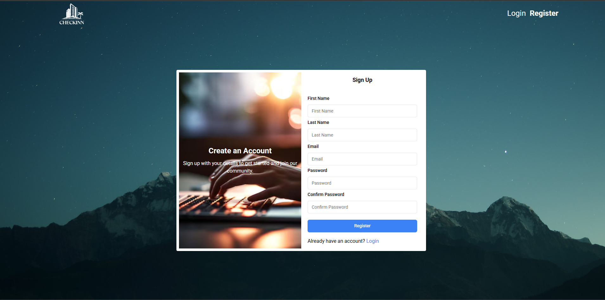
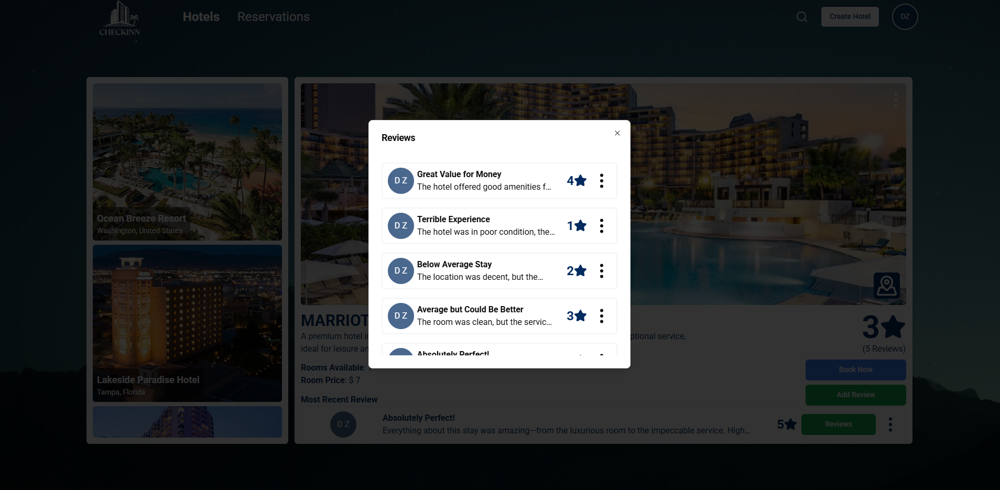
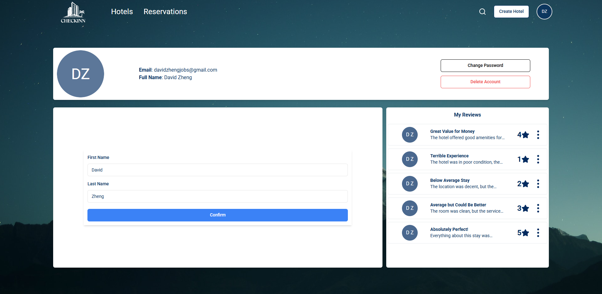
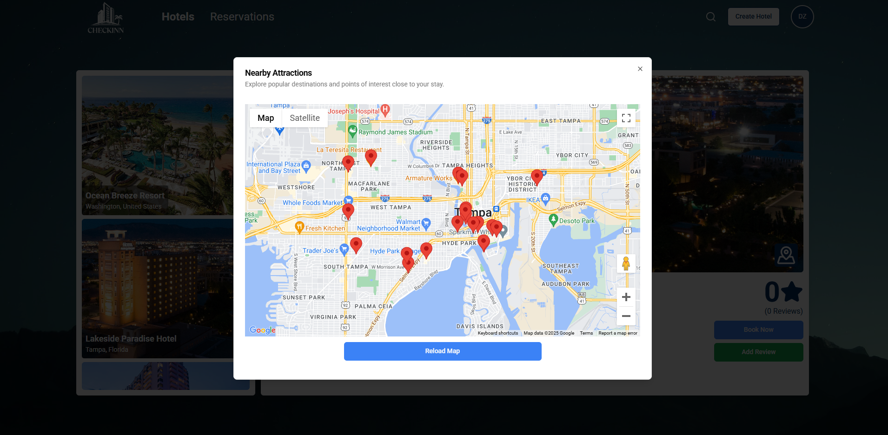
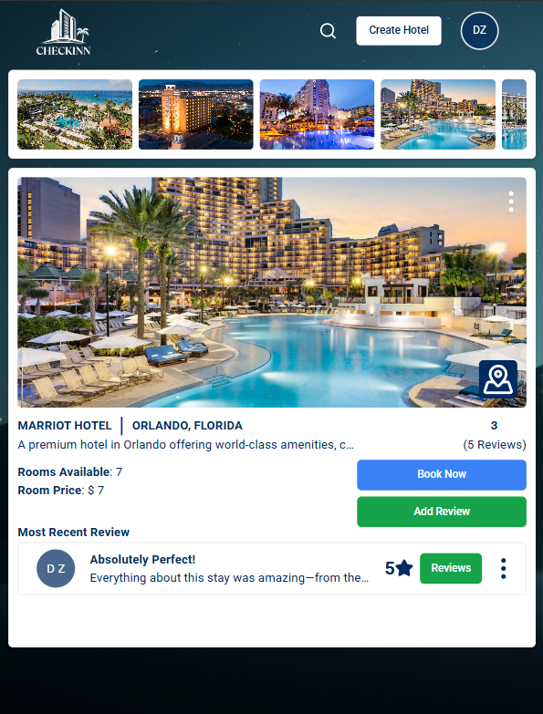
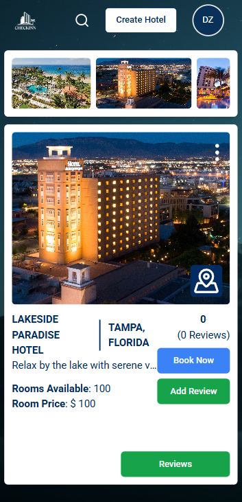

# Hotel Booking App - Check Inn

  

## :pencil: Descriptions:

The hotel management web application allows users to browse hotels, make bookings, and submit reviews based on their stay. On the frontend, built with TypeScript and React, users can view a list of hotels, filter by location or hotel, and easily book a room. The reviews section lets users rate their experience and provide feedback, which is stored and displayed dynamically. On the backend, the Spring Framework handles API requests, manages hotel and user data, and ensures secure user authentication. The application integrates hotel availability, user profiles, booking status, and review management to create a seamless experience. The backend repository can be found clicking the link [here](https://github.com/Training-241209/hotel-booking-back-end).

## :camera: Pictures:

## :bar_chart: ERDS:

## :two_men_holding_hands: User Stories:

- As a user, I can register and login
- As a user, I can create, read, update, and delete my own reviews
- As a user, I can create, read, and delete my own reservations
- As a user, I can search hotels by name or location
- As a user, I can update/delete my own information

- As a manager, I can do everything user can
- As a manager, I can add, update, delete hotels
- As a manager, I can read and delete reviews
- As a manager, I can read and delete reservations

## :computer: Technologies Used:

Here's the markdown with badges added for each technology:

### Frontend
- 
- 
- 
- 
- 
- 
- 

### Backend
- 
- 
- 
- 
- 

### DevOps
- 
- 
- 
- 

## :satellite: Next Steps:
Here are some potential improvements for the project:

- Use an API to fetch real hotel data.
- Allow users to filter nearby amenities on Google Maps.
- Host hotel images on S3.
- Allow users to update their reservations.
- Create a manager view.
